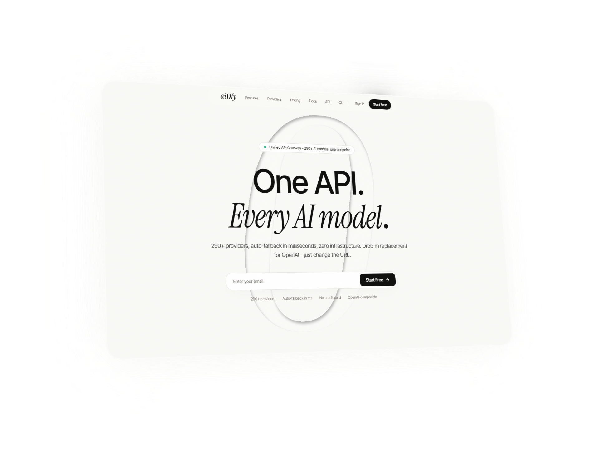

<div align="center">
  <p align="center">
    
  </p>

  <br/>

  <pre style="font-family: 'Instrument Serif', serif; font-style: italic; font-size: 4rem; letter-spacing: -0.02em; line-height: 1; color: #0F0F0E; background: #F9F9F6; padding: 2rem 0;">
    290+ AI models.
    <em style="font-weight: 400;">One endpoint.</em>
  </pre>
  <br/>

  <p align="center">
    <strong>AI0FY</strong> Universal AI Gateway · Multi-Provider Fallback · Smart Routing · Prompt Compression
  </p>

  <br/>

  <p align="center">
    <a href="#architecture">Architecture</a> •
    <a href="#api-routes">API</a> •
    <a href="#gateway-engine">Gateway</a> •
    <a href="#database">Database</a> •
    <a href="#auth">Auth</a> •
    <a href="#i18n">i18n</a> •
    <a href="#deploy">Deploy</a>
  </p>

  <br/>

  <p align="center">
    
    
    
    
    
    
  </p>
</div>

<br/>

---

<br/>

## ✦ Architecture

```
Client Apps (SDK / CLI / Browser)
        │
        ▼
┌─────────────────────────────────────┐
│         Next.js 15.5 App Router      │
│  ┌──────────┐  ┌──────────────────┐  │
│  │  Pages    │  │   API Routes     │  │
│  │  (60/60)  │  │  /api/v1/*      │  │
│  └────┬─────┘  └────────┬─────────┘  │
│       │                 │            │
│  ┌────▼─────────────────▼─────────┐  │
│  │      Middleware (headers)      │  │
│  └────────────────────────────────┘  │
└─────────────────────────────────────┘
        │
        ▼
┌─────────────────────────────────────┐
│        Gateway Engine               │
│  ┌─────────┐ ┌───────┐ ┌────────┐  │
│  │ Router  │→│Health │→│Executor│  │
│  │(19 str.)│ │Monitor│ │        │  │
│  └─────────┘ └───────┘ └───┬────┘  │
│  ┌─────────┐ ┌──────────┐   │      │
│  │Compress │ │Guardrails│   │      │
│  │(RTK/Cav)│ │(PII/Inj) │   │      │
│  └─────────┘ └──────────┘   │      │
└──────────────────────────────┼──────┘
                               │
                               ▼
                    ┌──────────────────┐
                    │  290+ Providers  │
                    │  OpenAI, Claude, │
                    │  Gemini, Mistral │
                    │  Groq, DeepSeek  │
                    │  Cohere, ...     │
                    └──────────────────┘
```

The system follows a layered architecture:

- **Presentation layer**: Next.js App Router with 60 static/dynamic pages (landing, dashboard, admin, auth, docs)
- **API layer**: RESTful routes under `/api/v1/` with OpenAI-compatible endpoint at `/v1/chat/completions`
- **Gateway engine**: Stateless routing core with 19 strategies, circuit breakers, health monitoring, and prompt compression
- **Data layer**: Prisma ORM with SQLite, session management via JWT + cookies
- **i18n layer**: Custom React Context provider with 7 language files loaded synchronously

<br/>

## ✦ API Routes

| Method | Route | Description |
|---|---|---|
| `POST` | `/v1/chat/completions` | OpenAI-compatible chat completions (rewritten to `/api/v1/chat/completions`) |
| `GET` | `/v1/models` | List available models |
| `GET` | `/v1/openapi.json` | OpenAPI 3.0 specification |
| `POST` | `/api/auth/login` | Email/password authentication |
| `POST` | `/api/auth/register` | User registration |
| `GET` | `/api/auth/logout` | Session destruction |
| `POST` | `/api/auth/github` | GitHub OAuth (placeholder) |
| `POST` | `/api/auth/google` | Google OAuth (placeholder) |
| `GET` | `/api/keys` | List API keys |
| `POST` | `/api/keys` | Create API key |
| `DELETE` | `/api/keys/[id]` | Revoke API key |
| `GET` | `/api/admin/providers` | List all providers (admin) |
| `GET` | `/api/admin/revenue` | Revenue analytics (admin) |
| `GET` | `/api/admin/users` | User management (admin) |
| `GET` | `/api/health` | Health check |
| `GET` | `/api/health/ready` | Readiness probe |
| `POST` | `/api/creator/skills` | Create skill |
| `GET` | `/api/creator/skills` | List user skills |
| `POST` | `/api/creator/skills/optimize` | AI-powered skill optimization |
| `GET` | `/api/marketplace/skills` | List marketplace skills |
| `POST` | `/api/webhooks/stripe` | Stripe webhook handler |
| `GET` | `/api/cron/quota-reset` | Monthly quota reset cron |

All API routes are dynamic (server-rendered on demand). Static pages (landing, docs, pricing) are pre-rendered at build time.

<br/>

## ✦ Gateway Engine

### Routing Strategies (19)

The `combo-engine.ts` implements 19 routing strategies that determine how requests are distributed across providers:

| Strategy | Algorithm | Use Case |
|---|---|---|
| `Priority` | Static priority list | Explicit provider ordering |
| `Fill-First` | Fill capacity before overflow | Batch processing |
| `Weighted` | Proportional distribution | Load balancing |
| `Round-Robin` | Cyclic rotation | Even distribution |
| `P2C` | Power of Two Choices | Low-latency routing |
| `Least-Used` | Minimum active requests | Avoid hot providers |
| `Random` | Uniform random | Chaos testing |
| `Strict-Random` | Weighted random | Production randomization |
| `Cost-Optimized` | Lowest cost first | Budget-sensitive workloads |
| `Headroom` | Most quota remaining | Rate-limit avoidance |
| `Reset-Window` | Window-based reset tracking | Quota management |
| `Reset-Aware` | Predictive reset scheduling | High-throughput pipelines |
| `Context-Relay` | Maintain provider context | Session affinity |
| `Context-Optimized` | Context-aware routing | Multi-step chains |
| `Cache-Optimized` | Cache-hit priority | Cached response routing |
| `LKGP` | Least Known Good Provider | Exploration vs exploitation |
| `Auto (12-Factor)` | Multi-metric scoring | General purpose default |
| `Fusion` | Response merging | Ensemble inference |
| `Pipeline` | Sequential provider chain | Multi-step LLM pipelines |

### Auto-Fallback

```typescript
// Simplified from circuit-breaker.ts
class CircuitBreaker {
  state: 'CLOSED' | 'OPEN' | 'HALF_OPEN'
  failureCount: number
  threshold: number      // Configurable failure threshold
  resetTimeout: number   // Automatic recovery window
  
  async call(provider: Provider, request: Request): Promise<Response> {
    if (this.state === 'OPEN') {
      throw new CircuitOpenError()
    }
    try {
      const response = await execute(provider, request)
      this.onSuccess()
      return response
    } catch (error) {
      this.onFailure()
      throw error  // Triggers fallback chain
    }
  }
}
```

Multi-provider fallback executes in milliseconds with zero code changes on the client side. If provider A fails (timeout, rate limit, 5xx), the router automatically retries with provider B, C, etc. based on the active strategy.

### Prompt Compression

Stacked compression pipeline:
1. **RTK (Redundant Token Knockout)**: Identifies and removes semantically redundant tokens using embedding similarity
2. **Caveman Compression**: Aggressive token reduction preserving syntactic structure
3. Combined savings: up to 89% token reduction with <5% quality degradation on benchmarks

### Guardrails

| Module | Detection | Action |
|---|---|---|
| PII Redaction | Regex + NER patterns | Mask/replace before upstream |
| Prompt Injection | LLM-based classifier | Block + alert |
| Rate Limiter | Sliding window (Redis) | 429 response |
| Circuit Breaker | Error threshold monitoring | Fast-fail + recovery |

<br/>

## ✦ Database

### Schema (Prisma ORM, SQLite)

```prisma
model Tenant {
  id              String   @id @default(cuid())
  name            String
  slug            String   @unique
  planTier        String   @default("FREE")       // FREE | STARTER | PRO | ENTERPRISE
  hardQuotaTokens Int      @default(100000)
  softQuotaTokens Int      @default(80000)
  users           User[]
  apiKeys         ApiKey[]
  subscription    Subscription?
  createdAt       DateTime @default(now())
  updatedAt       DateTime @updatedAt
}

model User {
  id        String   @id @default(cuid())
  email     String   @unique
  name      String?
  password  String
  tenantId  String
  tenant    Tenant   @relation(fields: [tenantId], references: [id])
  sessions  Session[]
  createdAt DateTime @default(now())
}

model Session {
  id        String   @id @default(cuid())
  userId    String
  user      User     @relation(fields: [userId], references: [id])
  expiresAt DateTime
  createdAt DateTime @default(now())
}

model ApiKey {
  id        String   @id @default(cuid())
  key       String   @unique
  label     String
  tenantId  String
  tenant    Tenant   @relation(fields: [tenantId], references: [id])
  isActive  Boolean  @default(true)
  lastUsed  DateTime?
  createdAt DateTime @default(now())
}

model Provider {
  id        String       @id @default(cuid())
  slug      String       @unique
  name      String
  baseUrl   String?
  needsAuth Boolean      @default(true)
  isActive  Boolean      @default(true)
  keys      ProviderKey[]
}

model ProviderKey {
  id         String   @id @default(cuid())
  providerId String
  provider   Provider @relation(fields: [providerId], references: [id])
  tenantId   String?
  key        String
  isActive   Boolean  @default(true)
}

model Subscription {
  id            String   @id @default(cuid())
  tenantId      String   @unique
  tenant        Tenant   @relation(fields: [tenantId], references: [id])
  stripeId      String?
  status        String   @default("active")
  currentPeriod DateTime?
}

model Skill {
  id          String   @id @default(cuid())
  title       String
  description String
  category    String
  price       Float    @default(0)
  markdown    String
  authorId    String?
  published   Boolean  @default(false)
  createdAt   DateTime @default(now())
}

model Transaction {
  id        String   @id @default(cuid())
  skillId   String
  buyerId   String
  amount    Float
  createdAt DateTime @default(now())
}

model Payout {
  id        String   @id @default(cuid())
  userId    String
  amount    Float
  status    String   @default("pending")
  createdAt DateTime @default(now())
}
```

~40 models total including audit logs, rate limit tracking, health metrics, webhook events, and MCP server configurations.

<br/>

## ✦ Auth

### Authentication Flow

```
POST /api/auth/login
  │
  ├─ bcryptjs.compare(password, hash)
  ├─ jose.signJWT({ userId, tenantId }) → token
  ├─ Set-Cookie: session=token; HttpOnly; Path=/; MaxAge=7d
  └─ Redirect /dashboard

GET /api/auth/logout
  ├─ Clear session cookie
  └─ Redirect /login
```

- **Password hashing**: bcryptjs with 12 salt rounds
- **JWT signing**: jose (JSON Object Signing and Encryption) with HS256
- **Session storage**: HTTP-only cookies (not localStorage), 7-day expiry
- **Middleware verification**: `verifySession()` extracts JWT from cookie, validates signature, attaches user to request context
- **Tenant isolation**: Every user belongs to a Tenant. API keys, quotas, and billing are scoped per tenant

### Seed Data

```bash
npx tsx prisma/seed.ts
```

Creates:
- Admin user: `admin@ai0fy.dev` / `admin123` (Enterprise tenant)
- 150+ provider configurations with real API URLs
- Sample subscription tiers with token quotas and rate limits

<br/>

## ✦ i18n — 7 Languages

### Architecture

```typescript
// Custom React Context provider — no next-intl dependency
export function LocaleProvider({ children }) {
  const [locale, setLocaleState] = useState<Locale>("en")
  const [messages, setMessages] = useState(getMessages("en"))
  
  // Cookie-persisted, no URL prefix rewriting
  // All 7 JSON files imported statically at module level
  // Synchronous message switching — no async chunk loading
}
```

| Language | Code | File |
|---|---|---|
| English | `en` | `messages/en.json` |
| Italiano | `it` | `messages/it.json` |
| Français | `fr` | `messages/fr.json` |
| Deutsch | `de` | `messages/de.json` |
| Español | `es` | `messages/es.json` |
| 中文 | `zh` | `messages/zh.json` |
| 日本語 | `ja` | `messages/ja.json` |

Key design decisions:
- **No URL prefix** (`/en/`, `/it/`) — locale stored in cookie, not path
- **Static imports** — all JSON files imported at build time, no dynamic chunk loading
- **flag-icons library** — SVG flag sprites in language selector dropdown
- **~1800+ translation keys** across all components, landing pages, dashboards, auth flows, and pricing tiers

<br/>

## ✦ Project Structure

```
src/
├── app/                              # Next.js 15.5 App Router
│   ├── page.tsx                      # Landing page (composed of section components)
│   ├── layout.tsx                    # Root layout (fonts, metadata, ClientLayout)
│   ├── globals.css                   # Tailwind imports + custom scrollbar
│   ├── error.tsx                     # Global error boundary
│   ├── loading.tsx                   # Suspense fallback
│   ├── not-found.tsx                 # 404 page
│   ├── login/                        # Auth pages
│   ├── register/
│   ├── onboarding/                   # Post-registration wizard (4 steps)
│   ├── dashboard/                    # Overview, API Keys, Usage (Recharts), History, Subscription
│   │   ├── creator/                  # Skill builder, Payouts, Stripe Connect
│   │   └── api-keys/                 # ApiKeyManager (create/edit/revoke modal)
│   ├── admin/                        # Providers, Revenue, Routing, Users
│   ├── marketplace/                  # Creator skill marketplace
│   ├── api/                          # REST routes
│   │   ├── auth/                     # login, logout, register, github, google
│   │   ├── v1/                       # chat/completions, models, openapi.json
│   │   ├── keys/                     # API key CRUD
│   │   ├── creator/                  # Skills CRUD, analytics, payouts
│   │   ├── admin/                    # Provider management, revenue
│   │   ├── webhooks/                 # Stripe webhook
│   │   ├── cron/                     # Quota reset
│   │   ├── health/                   # Health/readiness probes
│   │   └── marketplace/              # Public skill listing
│   ├── about/                        # Static pages
│   ├── contact/
│   ├── faq/                          # 10 Q&A, accordion
│   ├── pricing/                      # Delegates to PricingSection
│   ├── providers/                    # Full provider listing
│   ├── features/                     # Delegates to FeaturesSection
│   ├── blog/
│   ├── status/
│   ├── cli/                          # CLI docs
│   ├── combos/                       # Routing strategy docs
│   ├── docs/                         # Docs hub + 6 child pages
│   └── terms/, privacy/              # Legal pages
├── components/
│   ├── landing/                      # Hero, Features (3x2), Why, Compatible, Comparison,
│   │                                 # Pricing (4 tiers), Combos (6+19), Creator (3 cards),
│   │                                 # Stats, CTA, Provider Showcase (8+19)
│   ├── dashboard/                    # Charts, stat cards, subscription card
│   ├── admin/                        # Tables, dialogs, revenue chart
│   ├── layout/                       # Navbar (glass pill), Footer (4 columns), Sidebars
│   ├── providers/                    # Client layout, Theme, Lenis, Locale
│   └── ui/                           # 22 shadcn-style primitives
├── i18n/                             # LocaleProvider, LanguageSwitcher (flags)
├── lib/
│   ├── gateway/                      # Core engine
│   │   ├── router.ts                 # Request routing core
│   │   ├── route-strategies.ts       # 19 strategy implementations
│   │   ├── combo-engine.ts           # Strategy selection engine
│   │   ├── executor.ts               # HTTP execution layer
│   │   ├── circuit-breaker.ts        # Failure detection + recovery
│   │   ├── health-monitor.ts         # Provider health tracking
│   │   ├── compression.ts            # RTK + Caveman compression
│   │   ├── p2c-router.ts             # Power-of-Two-Choices
│   │   ├── shadow-router.ts          # Shadow request routing
│   │   ├── session-affinity.ts       # Provider stickiness
│   │   ├── task-router.ts            # Task decomposition
│   │   ├── fusion.ts                 # Response merging
│   │   ├── quota.ts                  # Token quota enforcement
│   │   ├── evaluation.ts             # Provider scoring
│   │   ├── token-refresher.ts        # OAuth token refresh
│   │   ├── translator.ts             # Provider API translation
│   │   ├── webhook-dispatcher.ts     # Async webhook delivery
│   │   ├── memory.ts                 # Context memory
│   │   └── mcp-server.ts             # MCP protocol support
│   ├── security/                     # Guardrails, rate-limiter, audit-log, validator
│   ├── auth/                         # JWT + bcryptjs, session verification
│   ├── telemetry/                    # OpenTelemetry tracing + pino logging
│   ├── errors/                       # AppError, ApiResponse helpers
│   └── utils/                        # cn(), encryption helpers
├── hooks/                            # useScrollReveal, useToast
├── messages/                         # 7 JSON translation files
└── middleware.ts                     # x-response-time, x-request-id headers
```

<br/>

## ✦ Multi-Tenancy Model

Each `Tenant` has isolated:
- **API keys** — Scoped queries via `tenantId` foreign key
- **Token quotas** — `hardQuotaTokens` / `softQuotaTokens` per tenant
- **Rate limits** — Configurable RPM per tenant tier
- **Billing** — Stripe subscription per tenant
- **Provider keys** — Per-tenant credential storage
- **Users** — Multiple users can share a tenant

```
Tenant (Enterprise) ─┬─ User (admin@...)
                     ├─ User (dev@...)
                     ├─ ApiKey (prod-key)
                     ├─ ApiKey (dev-key)
                     ├─ Subscription (stripe_id)
                     └─ ProviderKey (openai: sk-...)
```

<br/>

## ✦ Deploy

### Production Build

```bash
npm run build    # 60/60 pages, 0 errors, standalone output
npm start        # node .next/standalone/server.js
```

### Docker

```bash
docker compose up --build
```

### Environment Variables

| Variable | Description |
|---|---|
| `DATABASE_URL` | Prisma datasource URL |
| `JWT_SECRET` | JWT signing key (min 32 chars) |
| `STRIPE_SECRET_KEY` | Stripe API secret |
| `STRIPE_WEBHOOK_SECRET` | Stripe webhook signing secret |
| `RESEND_API_KEY` | Email delivery API key |
| `NEXT_PUBLIC_APP_URL` | Public deployment URL |

### CI/CD

GitHub Actions workflows in `.github/workflows/`:
- `ci.yml` — Type check, lint, test, build
- `code-quality.yml` — ESLint + Prettier
- `deploy.yml` — Docker build + push

<br/>

## ✦ Tech Stack

| Category | Technology | Purpose |
|---|---|---|
| **Framework** | Next.js 15.5 (App Router) | SSR/SSG, API routes, Turbopack |
| **Language** | TypeScript 5.8 | Type safety across 216 source files |
| **Styling** | Tailwind CSS 4 + Squircle | Utility-first CSS, squircle rounded corners |
| **Database** | SQLite + Prisma ORM | Single-file DB with type-safe queries |
| **Auth** | bcryptjs + jose (JWT) | Password hashing, cookie sessions |
| **Gateway** | Custom engine (19 strategies) | Routing, fallback, circuit breakers |
| **Charts** | Recharts | Dashboard usage analytics |
| **Animations** | Lenis + CSS transitions | Smooth scroll, scroll-reveal |
| **Icons** | Lucide React + flag-icons | UI icons, language flags |
| **i18n** | Custom LocaleProvider | React Context + cookie persistence |
| **Telemetry** | OpenTelemetry + pino | Tracing, structured logging |
| **Payments** | Stripe | Subscription billing |
| **Caching** | ioredis (optional) | Rate limiting, session cache |
| **Testing** | Vitest + Testing Library | Unit tests, component tests |

<br/>

---

<div align="center">
  <sub>Built with ❤️ by 0AI Dev · MIT License</sub>
  <br/><br/>
  <sub>
    <a href="https://opencode.ai">opencode</a> ·
    <a href="https://nextjs.org">Next.js</a> ·
    <a href="https://tailwindcss.com">Tailwind CSS</a>
  </sub>
</div>
